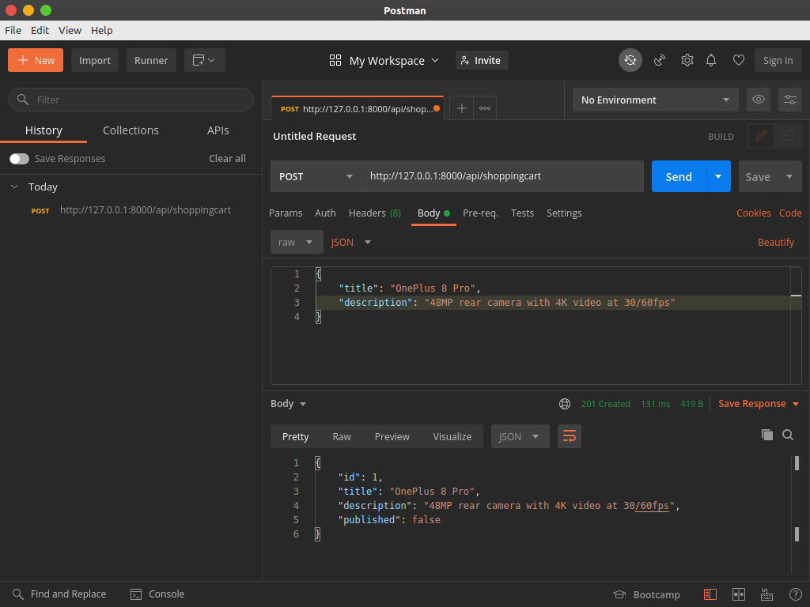
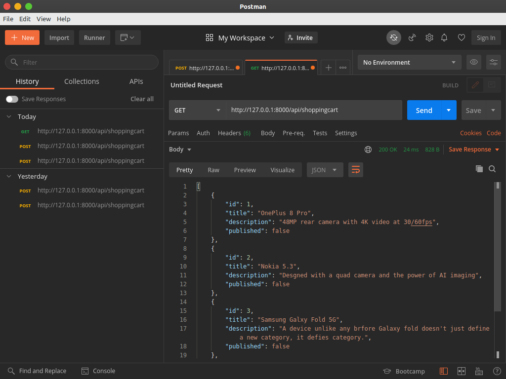
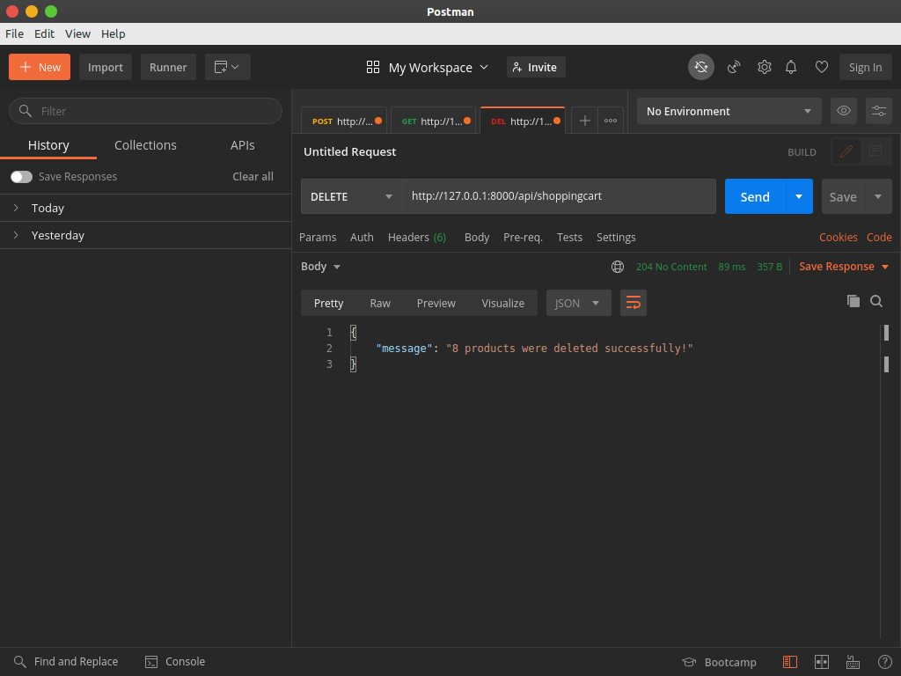

# Miskaa
shopping cart restapi
## Installation
Install [MongoDB](https://docs.mongodb.com/manual/installation/)

After Install open terminal and run command
```
sudo systemctl start mongodb
```
Use the package manager [pip](https://pip.pypa.io/en/stable/) to install virtualenv
### Linux or mac Users
```
pip3 install virtualenv
```
### Windows Users

```
pip install virtualenv
```

#### Create a new virtual environment inside the directory
```
python3 -m venv env
```
#### Activate scripts
```
source env/bin/activate
```

```
(env) $
```

After activate virtualenv install requirements.txt file
```
pip3 install -r requirements.txt
```

after all install complete 
```
python3 mange.py makemigrations shoppingcart
```
```
python3 mange.py migrate
```
```
Applying contenttypes.0001_initial... OK
  Applying auth.0001_initial... OK
  Applying admin.0001_initial... OK
  Applying admin.0002_logentry_remove_auto_add... OK
  Applying admin.0003_logentry_add_action_flag_choices... OK
  Applying contenttypes.0002_remove_content_type_name... OK
  Applying auth.0002_alter_permission_name_max_length... OK
  Applying auth.0003_alter_user_email_max_length... OK
  Applying auth.0004_alter_user_username_opts... OK
  Applying auth.0005_alter_user_last_login_null... OK
  Applying auth.0006_require_contenttypes_0002... OK
  Applying auth.0007_alter_validators_add_error_messages... OK
  Applying auth.0008_alter_user_username_max_length... OK
  Applying auth.0009_alter_user_last_name_max_length... OK
  Applying auth.0010_alter_group_name_max_length... OK
  Applying auth.0011_update_proxy_permissions... OK
  Applying auth.0012_alter_user_first_name_max_length... OK
  Applying sessions.0001_initial... OK

```
```
python3 mange.py runserver
```
```
Watching for file changes with StatReloader
Performing system checks...

System check identified no issues (0 silenced).
October 22, 2020 - 20:30:32
Django version 3.1.2, using settings 'Miskaa.settings'
Starting development server at http://127.0.0.1:8000/
Quit the server with CONTROL-C.

```
URL 

`/api/shoppingcart: GET, POST, DELETE`

`/api/shoppingcart/:id: GET, PUT, DELETE`

`/api/shoppingcart/published: GET`

## Post


## Get


## Put


## Delete

